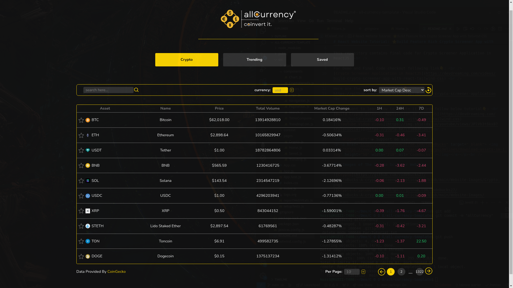
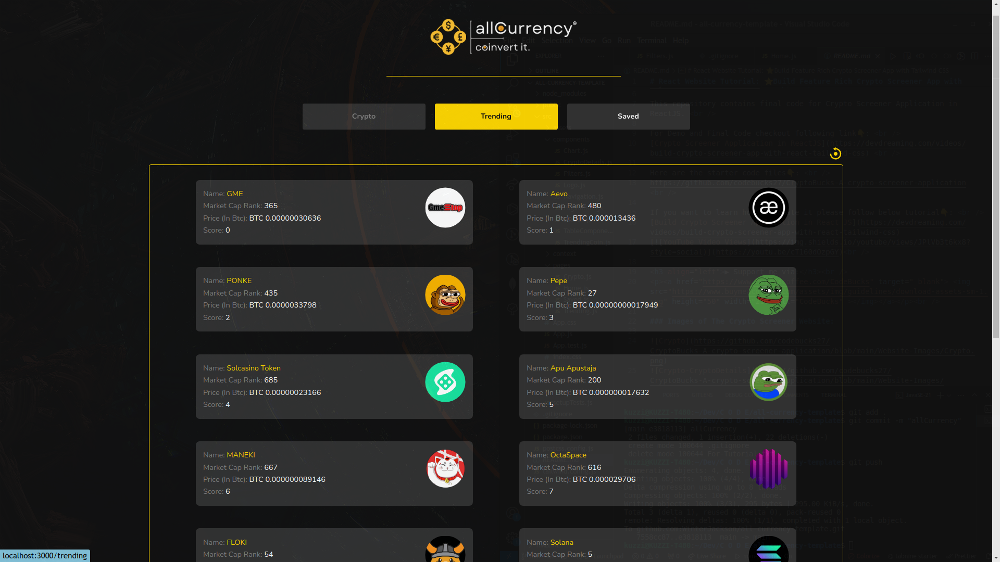

# allCurrency - Cryptocurrency Tool

This is a comprehensive tool for monitoring cryptocurrency exchange rates, tracking trends of individual cryptocurrencies, and displaying their current prices in various supported currencies. Whether you're a cryptocurrency enthusiast, investor, or trader, CryptoExchange provides valuable insights to help you stay informed and make informed decisions in the dynamic world of cryptocurrencies.

## Table of Contents
- Introduction
- Features
- Installation
- Usage
- Technologies Used
- Contribution
- License
- Author

## Introduction
It offers a centralized platform for accessing real-time data on cryptocurrency exchange rates and prices from the CoinGecko api. It simplifies the process of monitoring multiple cryptocurrencies and enables users to stay updated on market trends, facilitating informed decision-making.

## Features

### Cryptocurrency Exchange Rates
- View real-time exchange rates for various cryptocurrencies against different fiat currencies.
- Stay informed about fluctuations in exchange rates to optimize trading strategies and investment decisions.

### Cryptocurrency Trends
- Track trends of individual cryptocurrencies over time to identify patterns and assess market sentiment.
- Analyze historical data to make informed predictions and optimize trading strategies.

### Current Prices
- Access current prices of cryptocurrencies in different supported currencies.
- Monitor price movements and assess market dynamics to make timely investment decisions.

## Screenshots

    
    

## Installation
1. Clone the repository:

git clone git@github.com:WinterJackson/allCurrencyCrypto.git

2. Navigate to the project directory:

cd allCurrencyCrypto

## Usage
1. Install dependencies:

npm install

2. Start the application:

npm start

3. Open your preferred web browser and navigate to the provided URL.
4. Explore the various features explained above.

## Technologies Used
- React JS
- Tailwind CSS

## Contribution
Contributions to allCurrency are welcome! If you have any ideas, suggestions, or bug reports, please open an issue on the GitHub repository. You can also fork the repository, make changes, and submit a pull request.

## License
Licensed under the MIT License.

## Author
Winter Jackson

